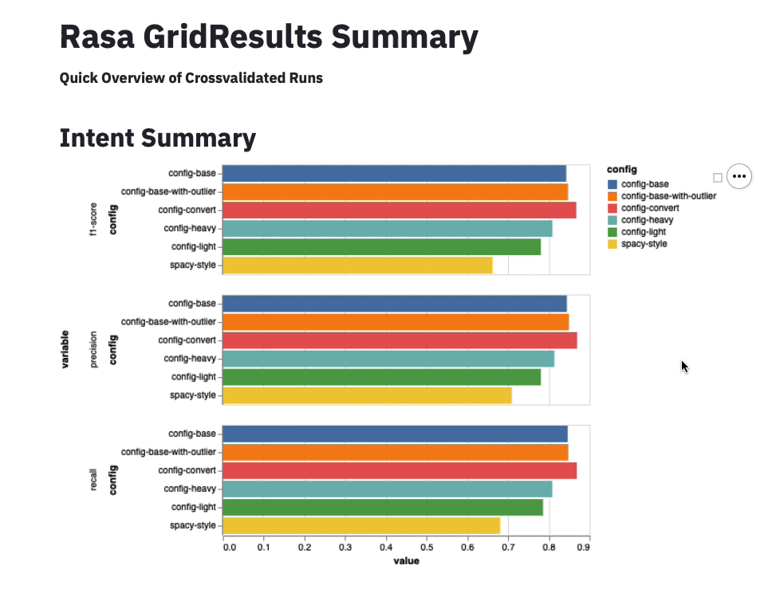
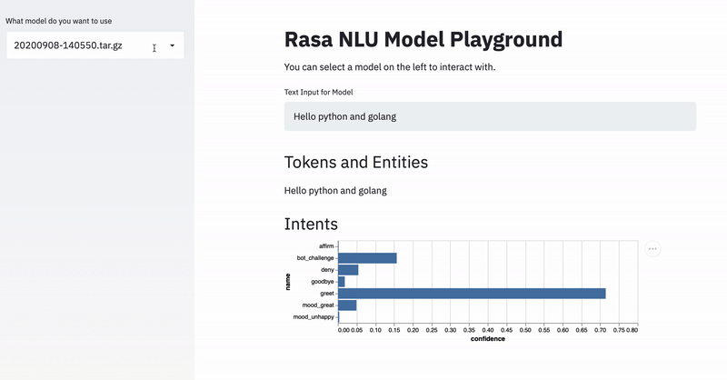
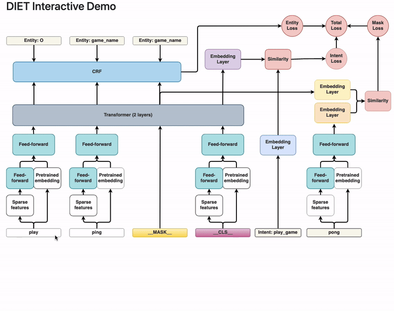

# RasaLit

A collection of helpful viewers that help with understand Rasa NLU components.
Some of these views are made using
[streamlit](https://github.com/streamlit/streamlit), hence the wink in the name.

Feedback is welcome.

## Contribute

There are many ways you can contribute to this project.

- You can suggest new features.
- You can help review new features.
- You can submit new components.
- You can let us know if there are bugs.
- You can let us know if the components in this library help you.

Feel free to start the discussion by opening an issue on this repository.
Before submitting code to the repository it would help if you first create
an issue so that we can disucss the changes you would like
to contribute. You can ping the maintainer (Github alias: **koaning**) both in
the issues here as well as on the [Rasa forum](https://forum.rasa.com)
if you have any questions.

## Installation

You can install via pip by linking to this github repository.

```
python -m pip install git+https://github.com/RasaHQ/rasalit
```

### Compatibility 

The focus is to support the most recent version of Rasa. We do tag a release every time that we upgrade though. That means you can find compatible versions of rasalit for [Rasa 1.10](https://github.com/RasaHQ/rasalit/tree/r1.10). 

## Usage

You can directly access the command line app.

```
> python -m rasalit --help
Usage: rasalit [OPTIONS] COMMAND [ARGS]...

  Helper Views for Rasa NLU

Options:
  --help  Show this message and exit.

Commands:
  diet-explorer  Allows you to explore the DIET settings.
  live-nlu       Select a trained Rasa model and interact with it.
  overview       Gives an overview of all `rasa train nlu` results.
  version        Prints the current version of rasalit.
```

## Features

The app contains a collection of viewers that each specialize in a seperate task.

### `overview`

This command shows an summary of the intent/entity scores from a `rasa train nlu` run.



Example Usage:

```
> python -m rasalit overview --folder gridresults --port 8501
```

This will start a server locally on port that will displace an interactive
dashboard of all your NLU gridsearch data.

To fully benefit from this feature you'll need to run some models first.
You can run cross validation of models in Rasa via the command line:

```
rasa test nlu --config configs/config-light.yml \
              --cross-validation --runs 1 --folds 2 \
              --out gridresults/config-light
rasa test nlu --config configs/config-heavy.yml \
              --cross-validation --runs 1 --folds 2 \
              --out gridresults/config-heavy
```

Then Rasa, in this case, will save the results in `gridresults/config-light` and
`gridresults/config-heavy` respectively.

To get an overview of all the results in subfolders of  `gridresults`,
you can run the `rasalit overview --folder gridresults` command from the same
folder where you ran the `rasa test` command. You'll get some simple charts
 that summarise the intent/entity performance.

### `live-nlu`

This command gives you an interactive gui that lets you see the output of a trained modelling pipeline.



Example Usage:

```
> python -m rasalit live-nlu --folder models --port 8501
```

This will start a server locally on port that will displace an interactive
playground for your trained Rasa NLU model. You can see the confidence levels as
well as the detected entities. We also show some shapes of internal featurization
steps.

### `diet-explorer`

This command gives you an interactive visualisation of DIET that allows you to see the available hyperparameters from all the layers in the algorithm.



Example Usage:

```
> rasalit diet-explorer --port 8501
```

This will start a server locally on port 8501 that will display an interactive
visualisation of the DIET architecture.
