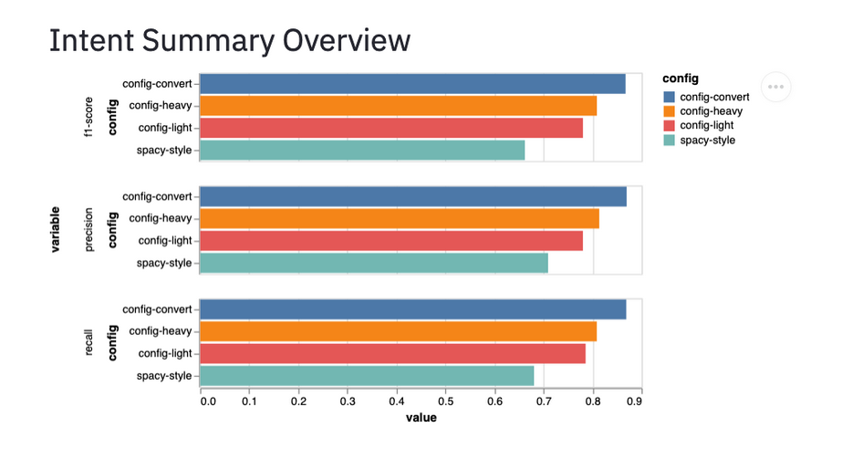

# RasaLit

A collection of helpful viewers that help with understand Rasa NLU components. Some of these views are made using [streamlit](https://github.com/streamlit/streamlit), hence the wink in the name. 

Feedback is welcome.

## Contribute

There are many ways you can contribute to this project. 

- You can suggest new features.
- You can help review new features. 
- You can submit new components.
- You can let us know if there are bugs.
- You can let us know if the components in this library help you.

Feel free to start the discussion by opening an issue on this repository. Before submitting code
to the repository it would help if you first create an issue so that the maintainers can disucss
the changes you would like to contribute. You can ping the maintainer (alias: **koaning**) both in the issues
here as well as on the [Rasa forum](https://forum.rasa.com) if you have any questions.

## Installation 

You can install via pip by linking to this github repository.

```
python -m pip install git+https://github.com/RasaHQ/rasalit
```

## Usage 

You can directly access the command line app. 

```
> rasalit --help
Usage: rasalit [OPTIONS] COMMAND [ARGS]...

  Helper Views for Rasa NLU

Options:
  --help  Show this message and exit.

Commands:
  diet-explorer  Allows you to explore the DIET settings.
  overview       Gives an overview of all results generated by `rasa train`.
```

But it may be safer to run like so; 

```
> python -m rasalit overview
  You can now view your Streamlit app in your browser.

  Local URL: http://localhost:8502
  Network URL: http://192.168.1.28:8502
```

## Features

The app contains a collection of viewers that each specialize in a seperate task. 

### `diet-explorer`

Example Usage: 

```
> rasalit diet-explorer --port 8501
```

This will start a server locally on port 8501 that will display an interactive visualisation of the DIET architecture. 


### `overview`

Example Usage: 

```
> rasalit overview --port 8501
```

This command is run via; 

```
> python -m rasalit overview
```

You can run cross validation of pipelines in Rasa via the command line.

```
rasa test nlu --config configs/config-light.yml \
              --cross-validation --runs 1 --folds 2 \
              --out gridresults/config-light
rasa test nlu --config configs/config-heavy.yml \
              --cross-validation --runs 1 --folds 2 \
              --out gridresults/config-heavy
```

Then rasa, in this case, will save the results in `gridresults/config-light` and 
`gridresults/config-heavy` respectively.

To get an overview of all the results in subfolders of  `gridresults`, 
you can run the `rasalit overview` command from the same folder was where you ran the `rasa test` command and you'll get some simple charts that summerise the intent/entity performance. 


